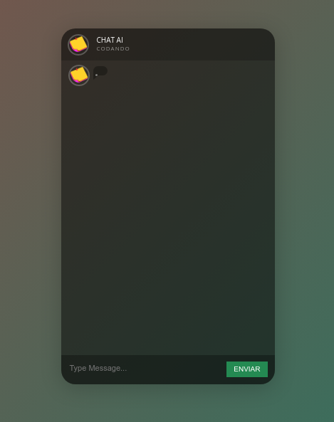

# Chat Fake - App




##


Repositório do app construido com o intuito educativo. 
## Executando o App. :heavy_check_mark:

Abaixo segue instruções para executar o app em seu navegador.

Comece clonando o respositório e, com o comando "cd fake-chat-app" você acessa a pasta onde ela foi feita o Download, depois execute o comando: index.html e o app será executado em seu navegador.


```sh
git clone https://github.com/rodineyw/fake-chat-app.git
cd fake-chat-app
index.html
```

### Back-end :art:

O Back-end desse projeto é construido em HTML 5, CSS e JavaScript.

### Funcionalidades :hammer:

A ideia é implementar o ChatGPT-4 ao app, para que o usuário possa conversar, como se realmente fosse um chat com um amigx. 

## Contribuições :construction_worker:

Estou muito feliz em ter vocês interessados em participar desse projeto.
Gostaria de pedir que, para facilitar a intereção entre todos, utilizem a [aba de discussões](https://github.com/rodineyw/fake-chat-app/discussions/2) para compartilhar ideias e sugestões para o projeto.

### Issues :pencil:

Caso encontrem algum problema durante o uso da aplicação ou queiram sugerir algo, utilizem a [aba de Issues](https://github.com/rodineyw/fake-chat-app/issues).

### Licença :card_index:

[MIT](https://github.com/rodineyw/fake-chat-app/blob/master/LICENSE)