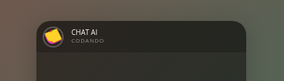

# Chat Fake - App

Repositório do app construido com o intuito educativo. 
## Executando o App. 

Abaixo segue instruções para executar o app em seu navegador.

Comece clonando o respositório e instalando suas dependências:

```sh
git clone https://github.com/rodineyw/fake-chat-app.git
cd fake-chat-app
index.html
```

### Back-end

O back-end desse projeto é construido em HTML 5, CSS e JavaScript.

## Funcionalidades

A ideia é implementa o ChatGPT-4 ao app, para que o usuário possa conversa, como se reamente fosse um chat em seu celular com um amigx. 